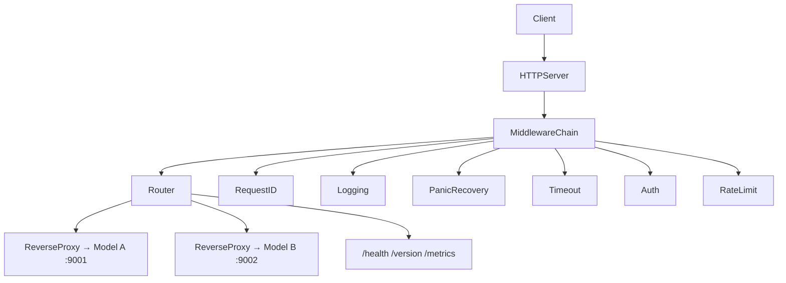

# AI Gateway Phase 1 — Concrete Build Plan

## Starting point

The workspace currently contains only [ai-gateway/Phase-1.md](ai-gateway/Phase-1.md). No Go code exists yet. We will scaffold the full layout described in that document and implement features in a strict dependency order so each step compiles, runs, and teaches one concept before the next layer is added.

**Your profile:** intermediate Go — we will emphasize production patterns (interfaces, explicit errors, testability, graceful shutdown) rather than language syntax basics.

**Mock upstreams:** two lightweight binaries under `cmd/` for local dev, plus `httptest` servers in unit/integration tests.

---

## Target architecture



**Middleware order (outer → inner):** PanicRecovery → RequestID → Logging → Timeout → Auth → RateLimit → Router

Rationale: panic recovery must wrap everything; request ID must exist before logging; timeout wraps downstream work; auth and rate limit apply before expensive proxy work.

---

## Project layout

```
ai-gateway/
├── cmd/
│   ├── gateway/main.go          # entrypoint, wiring, graceful shutdown
│   ├── mock-model-a/main.go     # dev upstream :9001
│   └── mock-model-b/main.go     # dev upstream :9002
├── internal/
│   ├── config/                  # env parsing + validation
│   ├── logging/                 # slog setup, request-scoped logger
│   ├── requestid/               # context key + middleware
│   ├── middleware/              # chain builder + individual middleware
│   ├── auth/                    # bearer token validation
│   ├── ratelimit/               # in-memory per-key limiter
│   ├── metrics/                 # counters + latency aggregation
│   ├── router/                  # path → upstream mapping
│   ├── proxy/                   # httputil.ReverseProxy wrapper
│   ├── handlers/                # /health, /version, /metrics
│   └── gateway/                 # Server type: wires everything
├── pkg/
│   └── response/                # JSON helpers, error envelope
├── test/
│   └── integration/             # full-stack tests with httptest upstreams
├── go.mod
└── README.md
```

Module path suggestion: `github.com/kayodeayelegun/ai-gateway` (adjust to your actual Git remote when you create one).

---

## Implementation milestones (build in this order)

Each milestone ends with: `go build ./...`, a manual smoke test, and (where applicable) tests.

### Milestone 0 — Scaffold and config

**What we build**

- `go mod init`, directory layout, minimal `cmd/gateway/main.go`
- [internal/config/config.go](ai-gateway/internal/config/config.go): load from env with defaults

| Env var           | Default                 | Purpose                                                 |
| ----------------- | ----------------------- | ------------------------------------------------------- |
| `PORT`            | `8080`                  | Listen address                                          |
| `MODEL_A_URL`     | `http://localhost:9001` | Chat upstream                                           |
| `MODEL_B_URL`     | `http://localhost:9002` | Embeddings upstream                                     |
| `API_TOKEN`       | (required)              | Valid bearer token (Phase 1 uses static token, not JWT) |
| `REQUEST_TIMEOUT` | `30s`                   | Per-request deadline                                    |
| `RATE_LIMIT`      | `100`                   | Requests per minute per API key                         |
| `LOG_LEVEL`       | `info`                  | slog level                                              |

**Go concepts:** packages and `internal/` visibility, struct tags, `time.ParseDuration`, explicit validation errors (fail fast on startup if `API_TOKEN` missing).

**Production habit:** config is a plain struct returned by `config.Load()` — no global `var Config`.

---

### Milestone 1 — HTTP server and local handlers

**What we build**

- `GET /health` → `{"status":"ok"}`
- `GET /version` → `{"version":"0.1.0"}` (compile-time `var` or `-ldflags` later)
- [pkg/response/response.go](ai-gateway/pkg/response/response.go): `JSON(w, status, v)`, `Error(w, status, msg)`

**Go concepts:** `net/http`, `http.HandlerFunc`, `http.ServeMux` vs custom mux (we'll use stdlib mux for now), JSON marshaling, `http.Status*` constants.

**Smoke test:** `curl localhost:8080/health`

---

### Milestone 2 — Structured logging

**What we build**

- [internal/logging/logging.go](ai-gateway/internal/logging/logging.go): configure `log/slog` with JSON handler to stdout
- Level from `LOG_LEVEL`

**Go concepts:** `slog.Logger`, `slog.Handler`, `slog.Level`, structured key-value logging.

**Production habit:** pass `*slog.Logger` into constructors; no package-level logger except maybe in `main`.

---

### Milestone 3 — Request ID middleware

**What we build**

- [internal/requestid/requestid.go](ai-gateway/internal/requestid/requestid.go)
- Read `X-Request-ID` header; if absent, generate UUID (use `github.com/google/uuid` or `crypto/rand` — uuid is idiomatic and small)
- Store in `context.Context`; set response header
- Helper: `requestid.FromContext(ctx) string`

**Go concepts:** `context.Context`, unexported context key type (avoid string key collisions), middleware signature `func(http.Handler) http.Handler`.

---

### Milestone 4 — Logging middleware

**What we build**

- [internal/middleware/logging.go](ai-gateway/internal/middleware/logging.go)
- Wrap handler; on completion log one JSON line:

```json
{
  "request_id": "...",
  "method": "POST",
  "path": "/v1/chat/completions",
  "status": 200,
  "latency_ms": 37,
  "client_ip": "127.0.0.1"
}
```

**Go concepts:** higher-order functions, `time.Since`, `http.ResponseWriter` wrapping (see Milestone 5 for status capture), `r.RemoteAddr` / `X-Forwarded-For` (document we use `RemoteAddr` in Phase 1).

---

### Milestone 5 — Middleware chain + status capture

**What we build**

- [internal/middleware/chain.go](ai-gateway/internal/middleware/chain.go): `Chain(handlers ...func(http.Handler) http.Handler) func(http.Handler) http.Handler`
- `responseWriter` wrapper to capture status code (default 200 if `WriteHeader` never called)

**Go concepts:** embedding, interface satisfaction, composing `http.Handler`s.

---

### Milestone 6 — Panic recovery

**What we build**

- [internal/middleware/recovery.go](ai-gateway/internal/middleware/recovery.go)
- `defer recover()`; log panic + stack; return `{"error":"internal server error"}` with 500

**Go concepts:** `defer`, `recover()`, panic vs error discipline (we recover only at HTTP boundary).

---

### Milestone 7 — Request timeout

**What we build**

- [internal/middleware/timeout.go](ai-gateway/internal/middleware/timeout.go)
- `context.WithTimeout(r.Context(), cfg.RequestTimeout)`; pass to downstream via `r.WithContext(ctx)`
- On `context.DeadlineExceeded`: 504 + `{"error":"gateway timeout"}`

**Go concepts:** context cancellation, `ctx.Err()`, propagating context to outbound proxy calls.

---

### Milestone 8 — Authentication

**What we build**

- [internal/auth/auth.go](ai-gateway/internal/auth/auth.go): `ValidateBearer(r *http.Request, expected string) error`
- [internal/middleware/auth.go](ai-gateway/internal/middleware/auth.go): 401 for missing/invalid, `subtle.ConstantTimeCompare` for token comparison

**Go concepts:** HTTP headers, string parsing (`strings.TrimPrefix`, `strings.Split`), security-minded comparison, sentinel errors (`ErrMissingToken`, `ErrInvalidToken`).

**Note:** Phase 1 uses a static `API_TOKEN`, not JWT — matches the spec's deliberate simplification.

---

### Milestone 9 — Rate limiting

**What we build**

- [internal/ratelimit/limiter.go](ai-gateway/internal/ratelimit/limiter.go)
- Token bucket or fixed window: 100 req/min per bearer token (extract token as key)
- `sync.Mutex` + `map[string]*clientLimiter`
- Middleware returns 429 when exceeded

**Go concepts:** mutexes, maps, concurrency safety, `time.Now()` windows, cleaning stale map entries (simple periodic sweep or lazy expiry).

**Production habit:** define a small interface `type Limiter interface { Allow(key string) bool }` so tests can inject a mock.

---

### Milestone 10 — Reverse proxy

**What we build**

- [internal/proxy/proxy.go](ai-gateway/internal/proxy/proxy.go): wrap `httputil.NewSingleHostReverseProxy`
- `Director` func: forward `X-Request-ID`, preserve method/body/headers
- Custom `ErrorHandler` for upstream unreachable → 502
- Use `http.Transport` with timeouts tied to request context

**Go concepts:** `httputil.ReverseProxy`, modifying outbound requests, `http.RoundTripper`, error handling at infrastructure boundaries.

---

### Milestone 11 — Router

**What we build**

- [internal/router/router.go](ai-gateway/internal/router/router.go)

| Gateway path                | Upstream                      |
| --------------------------- | ----------------------------- |
| `POST /v1/chat/completions` | `MODEL_A_URL` + `/chat`       |
| `POST /v1/embeddings`       | `MODEL_B_URL` + `/embeddings` |
| `POST /v1/audio`            | `MODEL_B_URL` + `/audio`      |

- Interface-driven design:

```go
type RouteTable interface {
    Handler(method, path string) (http.Handler, bool)
}
```

**Go concepts:** interfaces, `http.Handler` as universal contract, explicit 404 for unknown routes.

---

### Milestone 12 — Metrics

**What we build**

- [internal/metrics/metrics.go](ai-gateway/internal/metrics/metrics.go): thread-safe counters (`sync/atomic` or mutex)
- Increment in logging middleware or a thin metrics middleware
- `GET /metrics` → `{"requests":N,"errors":N,"average_latency":N}`

**Go concepts:** atomics vs mutex tradeoffs, computing running average (store total latency + count).

**Production habit:** metrics collector as injectable dependency, not globals.

---

### Milestone 13 — Gateway server wiring

**What we build**

- [internal/gateway/server.go](ai-gateway/internal/gateway/server.go): `New(cfg, deps) *http.Server` assembling mux, middleware chain, routes
- [cmd/gateway/main.go](ai-gateway/cmd/gateway/main.go): load config, create deps, start server

**Go concepts:** dependency injection by constructor, separation of `main` (wiring) from `internal` (logic).

---

### Milestone 14 — Graceful shutdown

**What we build**

- In `main`: `http.Server` with explicit `Addr`, `ReadHeaderTimeout`
- Listen for `SIGINT`/`SIGTERM` via `signal.Notify`
- `server.Shutdown(context.WithTimeout(..., 10s))` — drain in-flight requests

**Go concepts:** goroutines, channels, `os/signal`, `context` for shutdown deadline.

---

### Milestone 15 — Mock upstream servers

**What we build**

- [cmd/mock-model-a/main.go](ai-gateway/cmd/mock-model-a/main.go): `POST /chat` returns fixed JSON `{"model":"mock-a","message":"ok"}`
- [cmd/mock-model-b/main.go](ai-gateway/cmd/mock-model-b/main.go): `POST /embeddings`, `POST /audio` return stub JSON
- README section: run all three processes locally

**Go concepts:** multiple `main` packages in one module, minimal handlers for manual E2E.

---

### Milestone 16 — Testing

**What we build**

| Package            | Test focus                                    |
| ------------------ | --------------------------------------------- |
| `config`           | env parsing, validation errors                |
| `auth`             | table-driven: missing, invalid, valid token   |
| `requestid`        | reuse vs generate                             |
| `ratelimit`        | allows N, blocks N+1                          |
| `router`           | correct upstream per path                     |
| `middleware`       | status codes for timeout, auth, rate limit    |
| `test/integration` | full gateway + `httptest.NewServer` upstreams |

**Go concepts:** table-driven tests, `httptest.NewRecorder` / `httptest.NewServer`, `t.Parallel()` where safe, subtests with `t.Run`.

**Example integration flow:**

1. Spin up httptest upstream returning 200
2. Build gateway with test config pointing at it
3. `POST /v1/chat/completions` with valid bearer → assert proxied response + `X-Request-ID` header

---

### Milestone 17 — Benchmarks

**What we build**

- `BenchmarkHealthCheck` — baseline overhead
- `BenchmarkProxyPassthrough` — middleware + proxy stack with httptest upstream
- `BenchmarkRateLimiter` — hot-path cost of limiter

**Go concepts:** `testing.B`, `b.ResetTimer()`, `b.RunParallel()` for concurrent benchmark.

---

## Key interfaces (production-quality seams)

These small interfaces keep packages testable without over-abstracting:

```go
// internal/ratelimit
type Limiter interface {
    Allow(key string) bool
}

// internal/metrics
type Collector interface {
    RecordRequest(status int, latency time.Duration)
    Snapshot() Snapshot
}

// internal/router
type HandlerResolver interface {
    Resolve(method, path string) (http.Handler, bool)
}
```

---

## README deliverables

The README should document:

- Prerequisites (Go 1.22+)
- Env vars table
- How to run: `go run ./cmd/mock-model-a`, `go run ./cmd/mock-model-b`, `go run ./cmd/gateway`
- Example `curl` commands for each endpoint
- How to run tests and benchmarks

---

## Definition of done (Phase 1)

- [ ] Single `gateway` binary exposes all 6 endpoints per spec
- [ ] Proxy routes chat → A, embeddings/audio → B
- [ ] Full middleware stack in correct order
- [ ] All config via environment variables
- [ ] JSON structured logs per request
- [ ] `X-Request-ID` propagated upstream
- [ ] Bearer auth with 401/valid paths
- [ ] Panic → 500, timeout → 504, upstream failure → 502, rate limit → 429
- [ ] Graceful shutdown on SIGINT
- [ ] Unit tests for each package + at least one integration test
- [ ] At least one benchmark per hot path
- [ ] README with local dev instructions

---

## Suggested session pacing

We will implement **one milestone per working session** (roughly 1–2 hours each). After each milestone you will:

1. Run the gateway and verify with `curl`
2. Read a short note on the Go concept introduced
3. Review the code against the five production questions from Phase-1.md

Total: ~18 focused sessions to complete Phase 1 solidly.

**Recommended first session:** Milestones 0–1 (scaffold, config, health, version) — you will have a running server immediately.
